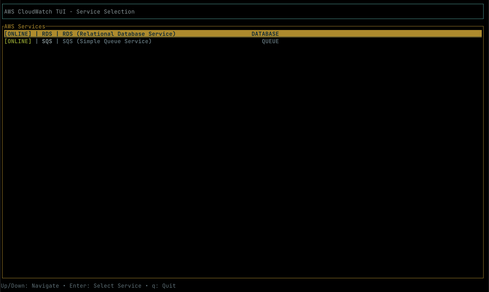
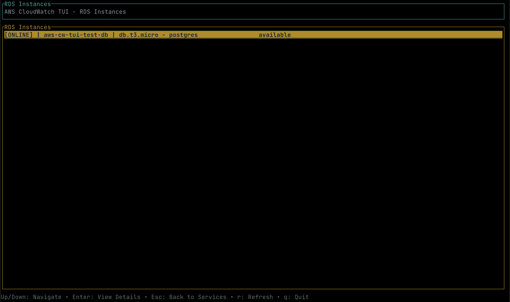
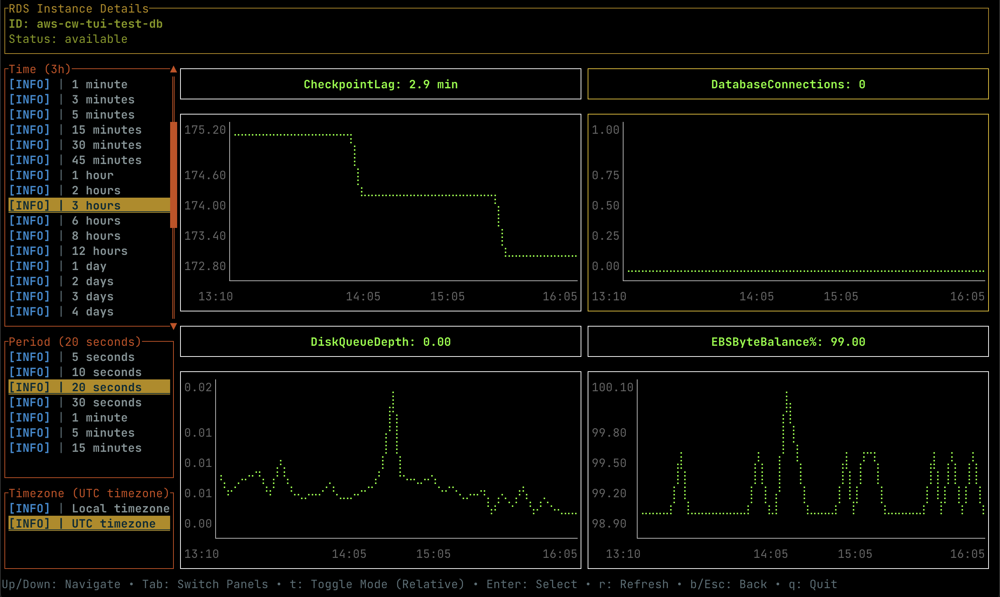
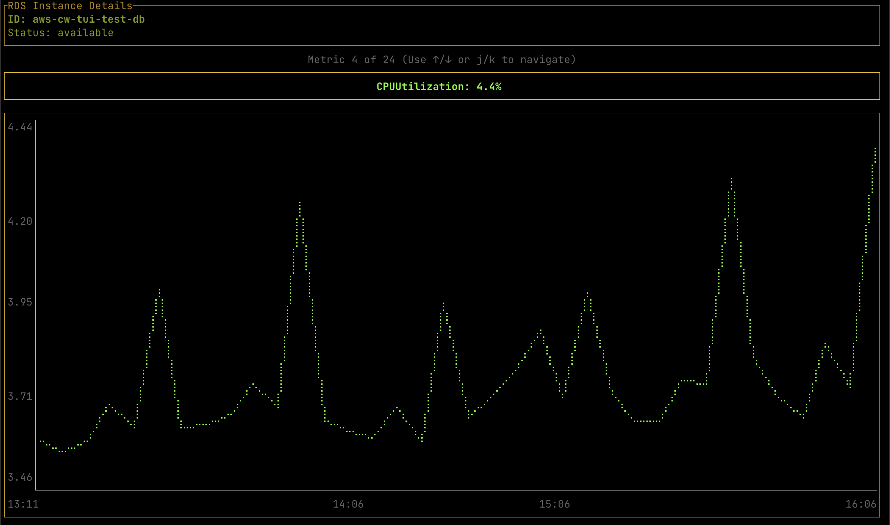

# AWS CloudWatch TUI

<div align="center">

**A powerful terminal user interface for AWS CloudWatch monitoring with real-time RDS metrics visualization**

[](https://github.com/emamulandalib/aws-cw-tui/releases)
[](LICENSE)
[](https://github.com/emamulandalib/aws-cw-tui/actions)

[Documentation](https://github.com/emamulandalib/aws-cw-tui/wiki) | [Quick Start](#quick-start) | [Features](#features) | [Community](https://github.com/emamulandalib/aws-cw-tui/discussions)

</div>

---

## Table of Contents

- [Overview](#overview)
- [Screenshots](#screenshots)
- [Features](#features)
- [Quick Start](#quick-start)
- [Installation](#installation)
- [Usage](#usage)
- [Configuration](#configuration)
- [Supported Metrics](#supported-metrics)
- [Development](#development)
- [Contributing](#contributing)
- [License](#license)

## Overview

AWS CloudWatch TUI is a comprehensive terminal-based monitoring solution that provides real-time visualization of AWS CloudWatch metrics. Built with modern Rust technologies, it offers an intuitive service selection interface for monitoring AWS services, starting with comprehensive RDS monitoring featuring professional-grade charts and extensive metric coverage.

## Screenshots

**Experience the power of terminal-based AWS monitoring with our sleek, professional interface:**

### Intuitive Service Selection

*Lightning-fast service navigation with clean, modern design - select from RDS, SQS, and more AWS services*

### Comprehensive Instance Overview

*Complete RDS instances dashboard with real-time status, connection details, and instant access to metrics*

### Real-Time Metrics Dashboard

*Professional CloudWatch integration showing all 27 RDS metrics with historical data and trend analysis*

### Detailed Performance Analytics

*High-resolution time-series charts with 3 hours of historical data for deep performance insights*

**Why choose AWS CloudWatch TUI?**
- **Instant Access**: No browser needed - monitor directly from your terminal
- **Complete Coverage**: All 27 AWS RDS metrics in one place
- **Beautiful Interface**: Clean, terminal-optimized design with professional aesthetics
- **Lightning Fast**: Real-time data with efficient CloudWatch API integration

## Features

### Enhanced RDS Monitoring
- **Comprehensive Metrics Collection**: All 27 AWS RDS metrics including CPU, IOPS, latency, throughput, network, memory, storage, and advanced engine-specific metrics
- **Real CloudWatch Time Series Data**: Actual timestamps from CloudWatch with proper time-based X-axis plotting
- **Extended Historical Data**: 3 hours of historical data (36 data points at 5-minute intervals) for trend analysis
- **Large High-Resolution Charts**: Enhanced Braille plotting with optimized chart areas for maximum visibility
- **Scrollable Interface**: Navigate through all 27 individual metrics with smooth scrolling
- **Single-Metric Layout**: Full-width charts for each metric for maximum detail visibility

### Modern UI Layout
- **27 Comprehensive Metrics**: Complete AWS RDS monitoring coverage organized in logical sections
  1. **Core Performance**: CPU Utilization, DB Connections, IOPS (Read/Write), Latency (Read/Write), Free Storage
  2. **Extended Performance**: Throughput (Read/Write), Network (RX/TX), Memory (Freeable/Swap), Queue Depth
  3. **Advanced Metrics**: Burst Balance, CPU Credits, Bin Log Usage, Replica Lag, Transaction Management
  4. **Engine-Specific**: PostgreSQL replication slots, SQL Server agent jobs, checkpoint lag, connection attempts

### CloudWatch-Style Visualization
- **High-Resolution Time Series Charts**: Enhanced Braille plotting with larger chart areas for better visualization
- **Single-Metric Layout**: Full-width individual metric charts for maximum detail and clarity
- **Scrollable Interface**: Navigate through all 27 metrics using ↑/↓ or k/j keys
- **Real-time Values**: Current metric values displayed cleanly with appropriate units and formatting
- **Accurate Time Labels**: X-axis shows relative time ("-3h", "-2h", "-1h", "now") based on actual data timestamps
- **Intelligent Scaling**: Automatic Y-axis scaling with proper bounds handling and 5-10% padding
- **Color-coded Metrics**: Each metric type has distinct colors for easy identification
- **Professional Charts**: CloudWatch-style line charts using ratatui's Chart widget with enhanced Braille markers

### Enhanced Data Collection
- **Real CloudWatch Integration**: Fetches actual time series data with timestamps from AWS CloudWatch
- **Comprehensive AWS Integration**: Fetches all major RDS CloudWatch metrics
- **Timestamp Accuracy**: Preserves original CloudWatch timestamps for accurate time-based plotting
- **Error Handling**: Robust error handling for AWS API calls with fallback time calculation
- **Performance Optimized**: Efficient data collection and visualization with concurrent metric fetching

## Quick Start

### Option 1: Download Pre-built Binary

Download the latest release for your platform:

**Linux (x86_64)**
```bash
curl -L https://github.com/emamulandalib/aws-cw-tui/releases/latest/download/awscw-linux-x86_64.tar.gz | tar xz
sudo mv awscw /usr/local/bin/
```

**macOS (Apple Silicon)**
```bash
curl -L https://github.com/emamulandalib/aws-cw-tui/releases/latest/download/awscw-macos-aarch64.tar.gz | tar xz
sudo mv awscw /usr/local/bin/
```

**macOS (Intel)**
```bash
curl -L https://github.com/emamulandalib/aws-cw-tui/releases/latest/download/awscw-macos-x86_64.tar.gz | tar xz
sudo mv awscw /usr/local/bin/
```

**Windows**
```powershell
# Download from releases page
Invoke-WebRequest -Uri "https://github.com/emamulandalib/aws-cw-tui/releases/latest/download/awscw-windows-x86_64.zip" -OutFile "awscw.zip"
Expand-Archive -Path "awscw.zip" -DestinationPath "."
# Add awscw.exe to your PATH
```

### Option 2: Install from Source

```bash
# Prerequisites: Rust 1.70+ required
git clone https://github.com/emamulandalib/aws-cw-tui.git
cd aws-cw-tui
cargo install --path .
```

### Configure AWS Credentials

```bash
aws configure
# OR set environment variables
export AWS_ACCESS_KEY_ID=your_access_key
export AWS_SECRET_ACCESS_KEY=your_secret_key
export AWS_DEFAULT_REGION=us-east-1
```

### Run the Application

```bash
awscw
```

The application will start with a service selection screen where you can choose RDS monitoring.

## Installation

### Package Managers

**Cargo (Rust)**
```bash
cargo install awscw
```

**From Source**
```bash
git clone https://github.com/emamulandalib/aws-cw-tui.git
cd aws-cw-tui
cargo install --path .
```

**Pre-built Binaries**

Visit our [releases page](https://github.com/emamulandalib/aws-cw-tui/releases) to download pre-built binaries for:
- Linux (x86_64, ARM64)
- macOS (Intel, Apple Silicon)  
- Windows (x86_64)

## Usage

### Getting Started

To start monitoring AWS services:

```bash
awscw
```

The application will start with a **service selection screen** where you can:
1. Choose from available AWS services (currently RDS)
2. Navigate using arrow keys
3. Press Enter to select a service and view instances

### Navigation

**Service Selection Screen:**
- **Arrow Keys**: Navigate through available AWS services
- **Enter**: Select a service to view instances

**Instance List Screen:**
- **Arrow Keys**: Navigate through instances list (e.g., RDS instances)
- **Enter**: Select an instance to view detailed metrics
- **'b'**: Go back to service selection

**Metrics View Screen:**
- **Arrow Keys / k/j**: Scroll through metric pairs (↑/↓ or k/j)
- **Home**: Reset scroll position to top
- **'b'**: Go back to instance list
- **'r'**: Refresh metrics data (3-hour historical data collection)
- **'q'**: Quit the application (available from any screen)

### Enhanced Metrics Dashboard

When viewing an RDS instance, you'll see:

1. **Instance Information**: Engine type, status, instance class, and endpoint
2. **Comprehensive Metrics Display**: All 27 AWS RDS metrics individually displayed:
   - **Core Performance** (7): CPU Utilization, DB Connections, Read/Write IOPS, Read/Write Latency, Free Storage
   - **Extended Performance** (7): Read/Write Throughput, Network RX/TX, Freeable Memory, Swap Usage, Queue Depth
   - **Advanced Metrics** (13): Burst Balance, CPU Credits, Bin Log Usage, Replica Lag, Transaction Management, Engine-specific metrics
3. **Full-Width High-Resolution Charts**: Each metric displays in a dedicated chart with 3-hour time series data
4. **Scrollable Interface**: Navigate through all 27 metrics with smooth scrolling

## Configuration

### AWS Credentials

Ensure your AWS credentials are configured using one of these methods:

**AWS CLI Configuration**
```bash
aws configure
```

**Environment Variables**
```bash
export AWS_ACCESS_KEY_ID=your_access_key
export AWS_SECRET_ACCESS_KEY=your_secret_key
export AWS_DEFAULT_REGION=us-east-1
```

**AWS Profile**
```bash
export AWS_PROFILE=your-profile-name
awscw
```

**IAM Instance Profile** (when running on EC2)
```bash
# No additional configuration needed
awscw
```

### Required AWS Permissions

The application requires the following IAM permissions:

```json
{
    "Version": "2012-10-17",
    "Statement": [
        {
            "Effect": "Allow",
            "Action": [
                "rds:DescribeDBInstances",
                "cloudwatch:GetMetricStatistics",
                "cloudwatch:ListMetrics"
            ],
            "Resource": "*"
        }
    ]
}
```

## Supported Metrics

The application monitors all 27 comprehensive RDS metrics:

### Core Performance (7 metrics)
- CPU Utilization, Database Connections, Free Storage Space
- Read/Write IOPS, Read/Write Latency

### Extended Performance (7 metrics)  
- Read/Write Throughput, Network Receive/Transmit Throughput
- Freeable Memory, Swap Usage, Queue Depth

### Advanced & Engine-Specific (13 metrics)
- **Storage & Credits**: Burst Balance, CPU Credit Usage/Balance
- **MySQL/MariaDB**: Binary Log Disk Usage, Connection Attempts
- **PostgreSQL**: Transaction IDs, Replication Slot Lag/Usage, Transaction Log Usage/Generation
- **SQL Server**: Failed Agent Jobs, Checkpoint Lag
- **General**: Replica Lag (Read Replicas)

## Technical Features

### High-Resolution Line Charts
- **Enhanced Braille Charts**: Full-width, high-resolution time series charts with optimized spacing
- **Scrollable Metric Display**: Navigate through all 27 metrics individually using ↑/↓ or k/j keys
- **Single-Metric Layout**: Each metric gets a dedicated full-width chart for maximum detail
- **3-Hour Data Window**: 36 data points at 5-minute intervals with precise timestamp plotting
- **Real-time Updates**: Fresh data on every refresh with proper time-series visualization
- **Smart Bounds**: Automatic Y-axis scaling with 5-10% padding for optimal visualization

### Data Collection
- **3-Hour Window**: 36 data points at 5-minute intervals
- **Real-time Updates**: Fresh data on every refresh
- **Unit Conversion**: Automatic formatting (bytes→GB/MB, seconds→ms)

## Development

### Prerequisites

- Rust 1.70+ 
- AWS CLI (optional, for credential management)

### Building from Source

```bash
git clone https://github.com/emamulandalib/aws-cw-tui.git
cd aws-cw-tui
cargo build --release
```

### Running Tests

```bash
cargo test
```

### Development Mode

```bash
cargo run
```

### Project Structure

```
aws-cw-tui/
├── src/
│   ├── main.rs           # Application entry point
│   ├── ui/               # TUI components and layouts
│   ├── aws/              # AWS service integrations
│   └── metrics/          # Metric collection and processing
├── Cargo.toml           # Project dependencies
└── README.md           # This file
```

## Contributing

We welcome contributions! Please see our [Contributing Guide](CONTRIBUTING.md) for details.

### Quick Start for Contributors

1. **Fork the repository**
2. **Create a feature branch**: `git checkout -b feature/amazing-feature`
3. **Make your changes** and add tests
4. **Run the test suite**: `cargo test`
5. **Commit your changes**: `git commit -m 'Add amazing feature'`
6. **Push to the branch**: `git push origin feature/amazing-feature`
7. **Open a Pull Request**

### Reporting Issues

- **Bug Reports**: Use the [bug report template](.github/ISSUE_TEMPLATE/bug_report.md)
- **Feature Requests**: Use the [feature request template](.github/ISSUE_TEMPLATE/feature_request.md)
- **Security Issues**: Email security@aws-cw-tui.dev

## Support

- **Documentation**: [Wiki](https://github.com/emamulandalib/aws-cw-tui/wiki)
- **Discussions**: [GitHub Discussions](https://github.com/emamulandalib/aws-cw-tui/discussions)
- **Issues**: [GitHub Issues](https://github.com/emamulandalib/aws-cw-tui/issues)

## Acknowledgments

- [ratatui](https://github.com/ratatui-org/ratatui) - Rust library for building rich terminal UIs
- [AWS SDK for Rust](https://github.com/awslabs/aws-sdk-rust) - Official AWS SDK
- [crossterm](https://github.com/crossterm-rs/crossterm) - Cross-platform terminal manipulation

## License

This project is licensed under the MIT License - see the [LICENSE](LICENSE) file for details.

---

<div align="center">

**Star this repository if you find it helpful!**

[Report Bug](https://github.com/emamulandalib/aws-cw-tui/issues) · [Request Feature](https://github.com/emamulandalib/aws-cw-tui/issues) · [Contribute](CONTRIBUTING.md)

Made with care for the AWS community

</div>
